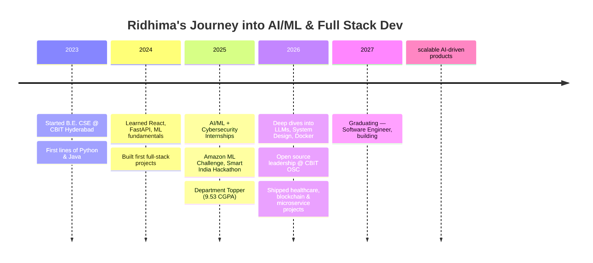

<p align="center">
<a href="https://linkedin.com/in/ridhima-gadalay-90b681298"></a>
<a href="https://leetcode.com/u/ridhima_1618/"></a>
<a href="https://www.geeksforgeeks.org/profile/ridhimag183"></a>
<a href="mailto:ridhima.gadalay@gmail.com"></a>
</p>

<p align="center">

</p>

<p align="center">


</p>

---

### 🚀 About Me

I'm a Computer Science Engineering student at Chaitanya Bharathi Institute of Technology, Hyderabad (CGPA: 9.53), specializing in AI/ML, Cybersecurity, and Full Stack Development.

I like building things that don't just work in a notebook — intelligent systems that ship, from fraud detection models to blockchain provenance trackers to real-time health platforms.

- 🔭 Currently building **Pest Vision**, a full-stack platform for a Hyderabad-based pest control business
- 🌱 Currently deepening my skills in Advanced DSA, LLM Applications, Docker, AWS, and System Design
- 🎯 Goal: become a Software Engineer at a top product company, building scalable AI-driven products
- ⚡ Fun fact: I've juggled AI/ML internships, cybersecurity assessments, and open-source leadership — all in the same year

---

### 🌱 My Journey



---

### 🛠️ Tech Stack

**Languages**
<p>


</p>

**Frontend**
<p>


</p>

**Backend**
<p>


</p>

**Databases**
<p>


</p>

**AI / ML**
<p>


</p>

**Blockchain / IoT**
<p>


</p>

**Tools**
<p>


</p>

---

### 📊 GitHub Stats

<p align="center">


</p>

<p align="center">

</p>

<p align="center">

</p>

---

### 🧩 Competitive Programming

Solving problems consistently to strengthen algorithmic thinking and prepare for software engineering interviews.

<p align="center">

</p>

<p>
<a href="https://leetcode.com/u/ridhima_1618/"></a>
<a href="https://www.geeksforgeeks.org/profile/ridhimag183"></a>
</p>

---

### 💼 Featured Projects

| Project | Description | Stack |
|---|---|---|
| 🤖 **Role Radar — Resume Classifier** | End-to-end NLP pipeline (Linear SVM, Random Forest, Naive Bayes) with a custom TF-IDF vectorizer (25K vocab), 81.3% accuracy. FastAPI + React with a 3-container Docker setup, SQLAlchemy ORM migrated from SQLite to PostgreSQL. | `Python` `NLTK` `TF-IDF` `Docker` `FastAPI` `React` |
| 🫀 **VitalIQ** | Clinical decision-support system that surfaces model predictions with SHAP-based explainability, so outputs stay interpretable for clinicians rather than being a black box. | `Python` `Scikit-learn` `SHAP` `FastAPI` `React` |
| ✈️ **Airline Reservation System** | Microservices-based reservation platform (final-year capstone) covering booking, search, and payment as independently deployable services. | `Java` `Spring Boot` `Microservices` `SQL` |
| 📄 **Summarify** | AI-powered document summarization tool using transformer models to condense long documents into digestible summaries. | `BART` `DistilBART` `FastAPI` `React` |
| 🏥 **Disease Diagnosis using ML** | Multi-class diagnostic engine using Decision Trees & SVM on 132-feature sparse matrices, with an NLP string-normalization pipeline for symptom-query parsing. | `Python` `Scikit-learn` `NLP` `Regex` |
| ⚡ **IoT-based Human Energy Harvesting System** | Energy harvesting system with 6 piezoelectric sensors + kinetic generator, ESP32-based real-time monitoring, Wi-Fi-enabled dashboard. | `ESP32` `IoT` `INA219` |
| 🧾 **SplitNest** | Payment and settlement platform for splitting and tracking shared expenses, built with a focus on clean transaction reconciliation. | `React` `Node.js` `MongoDB` |
| 💳 **Credit Card Fraud Detection** | Isolation Forest + supervised ensemble classifier on 30K+ transactions with extreme class skew. Stratified K-Fold CV + GridSearchCV tuning (95% accuracy), SHAP-based interpretability across 24 features. | `Python` `XGBoost` `Random Forest` `SMOTE` `SHAP` |

<p align="center">
<a href="https://github.com/ridhima183?tab=repositories"></a>
</p>

---

### 🧪 Experience

**AI/ML & Data Science Intern — AICTE Academy of Skill Development** *(Jul–Aug 2025)*
Built ML models with Python & Scikit-learn; handled data preprocessing, feature engineering, and model evaluation on real-world datasets.

**Cybersecurity Intern — Future Interns** *(Jul–Aug 2025)*
Conducted vulnerability assessments on OWASP Juice Shop & DVWA using Kali Linux; used Splunk for threat correlation, identifying SQL Injection, XSS, and CSRF vulnerabilities.

---

### 🏆 Achievements & Leadership

- 🥇 Department Topper (2024–25)
- 🏅 Competed in Amazon ML Challenge, Smart India Hackathon, HackIndia, Hacktoberfest CBIT
- 🎤 Coordinated logistics for 300+ participants at Toastmasters CBIT – SHRUTHI 2025
- 🚀 General Secretary, Nexiot — directed end-to-end operations for SUDEE 2026
- 📡 Joint Secretary, IEEE Aerospace Student Chapter
- 🌐 PR/Outreach Lead, CBIT Open Source Community — scaled developer engagement across 3 major events at SUDEE 2025

---

### 📜 Certifications

<p>


</p>

---

### 🗺️ Roadmap

```
2023 ── Started Engineering @ CBIT
2024 ── Machine Learning · Python · React
2025 ── AI Projects · Internships (AI/ML + Cybersecurity) · DSA
2026 ── Healthcare AI · Blockchain · Microservices · Placements
2027 ── Software Engineer, building scalable AI products
```

---

<div align="center">

> 💭 *"First, solve the problem. Then, write the code."*
> — John Johnson

</div>

### 📫 Connect with Me

<p>
<a href="https://linkedin.com/in/ridhima-gadalay-90b681298"></a>
<a href="https://leetcode.com/u/ridhima_1618/"></a>
<a href="https://www.geeksforgeeks.org/profile/ridhimag183"></a>
<a href="mailto:ridhima.gadalay@gmail.com"></a>
</p>

<p align="center"><em>Building intelligent software — from data to deployment. Thanks for visiting! 🚀</em></p>

<p align="center">

</p>


