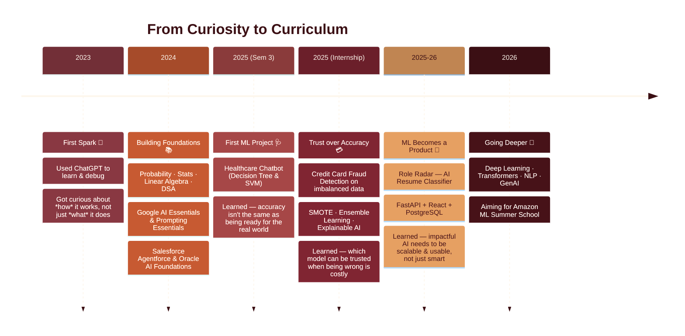

<p align="center">
  
</p>

<h1 align="center">🕯️ Hi there, I'm <span style="color:#722F37">Ridhima Gadalay</span> 🌹</h1>
<h3 align="center">🎓 CSE Student @ CBIT Hyderabad · 🤖 AI/ML Enthusiast · 💻 Full Stack Developer · 🔐 Cybersecurity</h3>

<p align="center">
  <a href="https://linkedin.com/in/ridhima-gadalay-90b681298" target="_blank">
    
  </a>
  <a href="https://leetcode.com/u/ridhima_1618/" target="_blank">
    
  </a>
  <a href="https://www.geeksforgeeks.org/profile/ridhimag183" target="_blank">
    
  </a>
  <a href="mailto:ridhima.gadalay@gmail.com">
    
  </a>
</p>

<p align="center">
  
</p>

<p align="center">
  
  
  
</p>

<p align="center">
  
</p>

<p align="center">
  
</p>

<p align="center">🍂 · 🕊️ · 🌹 · 📜 · 🍂</p>

---

### 🍁 About Me

<p align="center">
  
</p>

```yaml
name: Ridhima Gadalay
role: Computer Science Engineering Student
college: Chaitanya Bharathi Institute of Technology, Hyderabad
specialization: [AI/ML, Cybersecurity, IoT]
cgpa: 9.51 / 10
currently_building: "Pest Vision — full-stack Next.js platform for a pest control business"
currently_learning: [Advanced DSA, LLM Applications, Docker, AWS, System Design]
goal: "Software Engineer @ top product company, shipping scalable AI-driven products"
fun_fact: "Juggled AI/ML internships, cybersecurity assessments & open-source leadership — in the same year"
```

<details>
<summary>🕮 Ask me about</summary>
<br>

Python • Machine Learning • React & Next.js • FastAPI • SQL • Cybersecurity Fundamentals • Prompt Engineering • System Design (learning!)

</details>

---

### 🧭 My AI/ML Journey

> It started with one question: *how can a computer produce something that feels so remarkably human?* That's the question that pulled me into AI/ML — and every project since has just been me chasing the next question it raised.



<details>
<summary>🌱 <b>2023 — The Spark</b></summary>
<br>

Like most first-year engineers, I started using ChatGPT to understand concepts and debug code faster. But I kept asking a different question than everyone else: *how does a machine produce something this human?* That question became the seed for everything that followed.

</details>

<details>
<summary>📚 <b>2024 — Building Real Foundations</b></summary>
<br>

Using AI and *understanding* AI turned out to be very different things. I went back to fundamentals — probability, statistics, linear algebra, calculus, DSA — while stacking certifications: Google AI Essentials & Prompting Essentials, Salesforce Agentforce Specialist, and Oracle AI Foundations Associate.

</details>

<details>
<summary>🩺 <b>2025 — Healthcare Chatbot: Lesson #1, Prediction ≠ Readiness</b></summary>
<br>

My first real ML project — a disease-diagnosis chatbot using Decision Trees & SVM. It worked well in the notebook, but struggled on rare cases and couldn't explain its own decisions. That taught me the gap between a model that performs and a model that's *trustworthy*.

</details>

<details>
<summary>💳 <b>2025 — Credit Card Fraud Detection: Lesson #2, Trust over Accuracy</b></summary>
<br>

During my internship, I built a fraud detector on real, heavily imbalanced financial data. This is where I met explainable AI, anomaly detection, and ensemble learning — and where the question in my head shifted from *"which model performs best?"* to *"which model can I trust when being wrong is expensive?"*

</details>

<details>
<summary>🤖 <b>2025–26 — Role Radar: Lesson #3, ML is a Product</b></summary>
<br>

Role Radar, an AI resume classification platform, taught me that impactful AI isn't just about smart algorithms — it's about shipping something scalable, usable, and human-centered. Integrating NLP with FastAPI, React, and PostgreSQL turned a model into a real product.

</details>

<details>
<summary>🚀 <b>2026 — What's Next</b></summary>
<br>

Now deepening my understanding of deep learning, transformer architectures, NLP, and generative AI — with production-scale ML systems as the north star. Every solved problem has just been the start of the next question, and I'm not stopping now.

</details>

---

### 🧵 Tech Stack

<details open>
<summary><b>Click to expand / collapse</b></summary>
<br>

**Languages**
<p>
  
  
  
  
  
</p>

**Frontend**
<p>
  
  
  
  
  
</p>

**Backend**
<p>
  
  
  
</p>

**Databases**
<p>
  
  
  
  
</p>

**AI / ML**
<p>
  
  
  
  
  
  
  
</p>

**Tools & Platforms**
<p>
  
  
  
  
  
  
</p>

</details>

---

### 📜 GitHub Stats

<p align="center">
  
  
</p>

<p align="center">
  
</p>

<p align="center">
  
</p>

<p align="center">
  
</p>

---

### 🧵 Competitive Programming

Solving problems consistently to sharpen algorithmic thinking and prep for SWE interviews.

<p align="center">
  
</p>

<p align="center">
  <a href="https://leetcode.com/u/ridhima_1618/"></a>
  <a href="https://www.geeksforgeeks.org/profile/ridhimag183"></a>
</p>

---

### 🕰️ Featured Projects

#### 🐛 Pest Vision
A full-stack marketing + booking website built for a real Hyderabad-based pest control business, focused on conversion and polish rather than just a portfolio demo.
- Built with **Next.js 14 App Router** for fast, SEO-friendly page loads
- **Radix UI** primitives for accessible components + **Tailwind CSS** for a custom design system
- Form validation with **React Hook Form + Zod**, so bad inputs never hit the backend
- **Framer Motion** micro-interactions and scroll animations for a premium feel

`Next.js` `React` `Tailwind` `Radix UI` `Framer Motion` `Zod`

<br>

#### 🌹 Role Radar AI — Resume Classifier
An end-to-end NLP system that automatically classifies resumes into job categories, built as a group project to explore how ML models become real products.
- Custom **TF-IDF vectorizer** with a 25K-word vocabulary trained from scratch
- Compared **Linear SVM, Random Forest, and Naive Bayes**, landing on 81.3% classification accuracy
- **FastAPI** backend serving predictions to a **React** frontend
- Fully containerized with a **3-container Docker Compose** setup (API, DB, frontend)
- **SQLAlchemy ORM** with a migration path from SQLite → PostgreSQL for production readiness

`Python` `NLTK` `TF-IDF` `Docker` `FastAPI` `React` `PostgreSQL`

<br>

#### 🩺 VitalIQ — Clinical Decision Support
A clinical decision-support prototype that goes beyond "just predict" to focus on trust and explainability — critical in a healthcare context.
- **Random Forest models** trained on the UCI Heart Disease and Breast Cancer Wisconsin datasets
- **SHAP explainability** so every prediction comes with a "why," not just a number
- **JWT authentication** with role-based access control (clinician vs. admin views)
- Interactive **Recharts** dashboards for visualizing patient risk factors
- Full-stack architecture: **Next.js** frontend + **FastAPI** backend + **scikit-learn** models

`Next.js` `FastAPI` `Scikit-learn` `SHAP` `JWT` `Recharts`

<br>

#### 🍯 SplitNest — Roommate Expense Splitter
A practical full-stack app for splitting shared expenses among roommates, built to solve a real everyday problem.
- **JWT-based authentication** for secure multi-user access
- Group creation with multiple members per group
- Expense logging with automatic **equal-split balance calculation**
- **FastAPI + SQLAlchemy** backend with a **React (Vite)** frontend for a fast dev loop

`React` `Vite` `FastAPI` `SQLAlchemy` `SQLite`

<br>

#### 💳 Credit Card Fraud Detection
A fraud detection pipeline built during my AI/ML internship, tackling one of the hardest problems in ML: extreme class imbalance.
- **30,000+ transactions** with fraud cases making up a tiny fraction of the data
- Combined **Isolation Forest** (anomaly detection) with a **supervised ensemble** (Random Forest, XGBoost)
- Used **SMOTE** to rebalance classes and prevent the model from just predicting "not fraud" every time
- **Stratified K-Fold CV + GridSearchCV** hyperparameter tuning pushed accuracy to 95%
- **SHAP-based interpretability** across 24 features to explain *why* a transaction was flagged

`Python` `XGBoost` `Random Forest` `SMOTE` `SHAP` `Scikit-learn`

<br>

#### 🕊️ Disease Diagnosis using ML
A multi-class diagnostic engine that predicts likely diseases from user-described symptoms — my first end-to-end ML project.
- Trained **Decision Tree and SVM classifiers** on a 132-feature sparse symptom matrix
- Built a custom **NLP string-normalization pipeline** (regex-based) to parse free-text symptom queries into structured inputs
- Taught me that a model performing well in a notebook isn't automatically ready for messy, real-world input

`Python` `Scikit-learn` `NLP` `Regex`

<br>

#### 🍂 IoT-based Human Energy Harvesting System
A hardware + software IoT project exploring how human movement can be converted into usable, trackable energy.
- **6 piezoelectric sensors** paired with a kinetic generator to harvest motion-based energy
- **ESP32** microcontroller for real-time sensor monitoring and data transmission
- **INA219** current/voltage sensor for precise power measurement
- Live **I2C LCD display** for on-device readings
- **Wi-Fi-enabled Blynk** cloud dashboard for remote monitoring

`ESP32` `IoT` `Blynk` `INA219` `Embedded Systems`

<br>

#### 📚 More on GitHub →
22 public repos and counting — explore the full list of contributions and experiments.

[](https://github.com/ridhima183?tab=repositories)

---

### 🕯️ Experience

**🤖 AI/ML & Data Science Intern**
*AICTE Academy of Skill Development · Jul–Aug 2025*

Built ML models with Python & Scikit-learn; handled data preprocessing, feature engineering, and model evaluation on real-world datasets.

<br>

**🔐 Cybersecurity Intern**
*Future Interns · Jul–Aug 2025*

Conducted vulnerability assessments on OWASP Juice Shop & DVWA using Kali Linux; used Splunk for threat correlation, identifying SQL Injection, XSS, and CSRF vulnerabilities.

---

### 🌾 Currently Leveling Up

<p align="center">
  
</p>

```text
Advanced DSA & System Design   ███████████████░░░░░  75%
LLM Applications & Prompting   ████████████████░░░░  80%
Docker & AWS                   ██████████░░░░░░░░░░  50%
Deep Learning / Transformers   ████████░░░░░░░░░░░░  40%
```

---

### 🏵️ Achievements & Leadership

- 🥇 Department Topper (2024–25)
- 🏅 Competed in Amazon ML Challenge, Smart India Hackathon, HackIndia, Hacktoberfest CBIT
- 🎤 Coordinated logistics for 300+ participants at Toastmasters CBIT – SHRUTHI 2025
- 🚀 **General Secretary, Nexiot** — directed end-to-end operations for SUDEE 2026
- 📡 **Joint Secretary, IEEE Aerospace Student Chapter**
- 🌐 **PR/Outreach Lead, CBIT Open Source Community** — scaled developer engagement across 3 major events at SUDEE 2025

---

### 📖 Certifications

<p>
  
  
  
  
  
  
  
  
</p>

---

### 🗺️ Roadmap

```text
2023 ── Started Engineering @ CBIT
2024 ── Machine Learning · Python · React
2025 ── AI Projects · Internships (AI/ML + Cybersecurity) · DSA
2026 ── Placements · Open Source · Top Product Companies
2027 ── Software Engineer, building scalable AI products
```

---

<p align="center">
  <i>"First, solve the problem. Then, write the code."</i> — John Johnson
</p>

### 🕊️ Connect with Me

<p align="center">
  <a href="https://linkedin.com/in/ridhima-gadalay-90b681298" target="_blank"></a>
  <a href="https://leetcode.com/u/ridhima_1618/" target="_blank"></a>
  <a href="https://www.geeksforgeeks.org/profile/ridhimag183" target="_blank"></a>
  <a href="mailto:ridhima.gadalay@gmail.com"></a>
</p>

<p align="center"><i>🌹 Building intelligent software — from data to deployment. Thanks for visiting! 🍂</i></p>

<p align="center">
  
</p>
