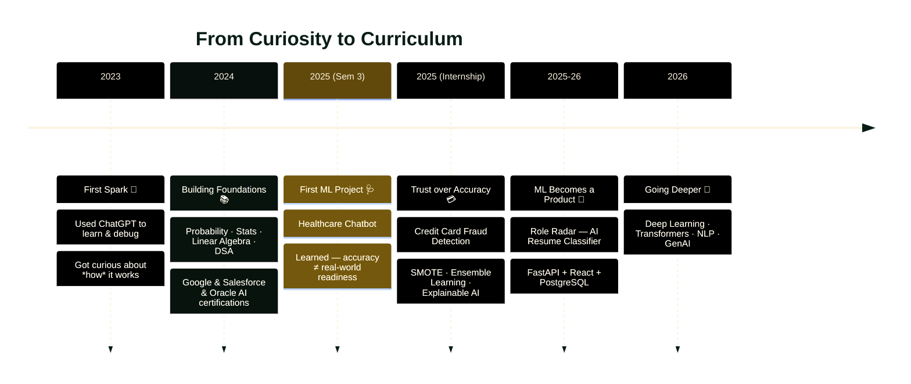

<p align="center">
  
</p>

<h3 align="center">🎓 CSE Student @ CBIT Hyderabad &nbsp;·&nbsp; 🤖 AI/ML &nbsp;·&nbsp; 💻 Full Stack &nbsp;·&nbsp; 🔐 Cybersecurity</h3>

<p align="center">
  <a href="https://linkedin.com/in/ridhima-gadalay-90b681298"></a>
  <a href="https://leetcode.com/u/ridhima_1618/"></a>
  <a href="https://www.geeksforgeeks.org/profile/ridhimag183"></a>
  <a href="mailto:ridhima.gadalay@gmail.com"></a>
</p>

<p align="center">
  
</p>

<p align="center">
  
  
  
</p>

<p align="center">
  
</p>

<div align="center">

╭──────────────────────────────────────────────╮

</div>

## 🌿 About Me

```yaml
name: Ridhima Gadalay
role: Computer Science Engineering Student
college: Chaitanya Bharathi Institute of Technology, Hyderabad
specialization: [AI/ML, Cybersecurity, IoT]
cgpa: 9.51 / 10
currently_building: "Pest Vision — full-stack Next.js platform for a pest control business"
currently_learning: [Advanced DSA, LLM Applications, Docker, AWS, System Design]
goal: "Software Engineer @ a top product company, shipping scalable AI-driven products"
```

> It started with one question: *how can a computer produce something that feels so remarkably human?* Every project since has just been me chasing the next question it raised.

<br>

## 🧭 My AI/ML Journey



<details>
<summary><b>🌱 2023 — The Spark</b></summary>
<br>
Like most first-year engineers, I started using ChatGPT to understand concepts and debug code faster. But one question stuck with me: <i>how does a machine produce something this human?</i> That question became the seed for everything that followed.
</details>

<details>
<summary><b>📚 2024 — Building Real Foundations</b></summary>
<br>
Using AI and <i>understanding</i> AI turned out to be very different things. I went back to fundamentals — probability, statistics, linear algebra, DSA — while stacking certifications: Google AI Essentials & Prompting Essentials, Salesforce Agentforce Specialist, and Oracle AI Foundations Associate.
</details>

<details>
<summary><b>🩺 2025 — Healthcare Chatbot: Prediction ≠ Readiness</b></summary>
<br>
My first real ML project — a disease-diagnosis chatbot using Decision Trees & SVM. It worked well in the notebook, but struggled on rare cases and couldn't explain its own decisions. That taught me the gap between a model that performs and one that's <i>trustworthy</i>.
</details>

<details>
<summary><b>💳 2025 — Credit Card Fraud Detection: Trust over Accuracy</b></summary>
<br>
During my internship, I built a fraud detector on real, heavily imbalanced financial data. This is where I met explainable AI, anomaly detection, and ensemble learning — and where my question shifted from "which model performs best?" to "which model can I trust when being wrong is expensive?"
</details>

<details>
<summary><b>🤖 2025–26 — Role Radar: ML is a Product</b></summary>
<br>
Role Radar, an AI resume classification platform, taught me that impactful AI isn't just smart algorithms — it's shipping something scalable, usable, and human-centered. Integrating NLP with FastAPI, React, and PostgreSQL turned a model into a real product.
</details>

<details>
<summary><b>🚀 2026 — What's Next</b></summary>
<br>
Now deepening my understanding of deep learning, transformer architectures, NLP, and generative AI — with production-scale ML systems as the north star.
</details>

<br>

## 🛠️ Tech Stack

<table>
<tr>
<td valign="top" width="50%">

**Languages**
<br>


**Frontend**
<br>


**Backend**
<br>


</td>
<td valign="top" width="50%">

**Databases**
<br>


**AI / ML**
<br>


**Tools & Platforms**
<br>


</td>
</tr>
</table>

<br>

## 📊 GitHub Stats

<p align="center">
  
  
</p>

<p align="center">
  
</p>

<p align="center">
  
</p>

<p align="center">
  
</p>

<br>

## 🧵 Competitive Programming

<p align="center">
  
</p>

<p align="center">
  <a href="https://leetcode.com/u/ridhima_1618/"></a>
  <a href="https://www.geeksforgeeks.org/profile/ridhimag183"></a>
</p>

<br>

## 🚀 Featured Projects

<table>
<tr><td width="100%">

### 🐛 Pest Vision
Full-stack marketing + booking website for a real Hyderabad-based pest control business, focused on conversion and polish rather than a portfolio demo.
- **Next.js 14 App Router** for fast, SEO-friendly page loads
- **Radix UI** + **Tailwind CSS** custom design system
- **React Hook Form + Zod** validation on every input
- **Framer Motion** micro-interactions and scroll animations

`Next.js` `React` `Tailwind` `Radix UI` `Framer Motion` `Zod`

</td></tr>
<tr><td width="100%">

### 🌹 Role Radar AI — Resume Classifier
End-to-end NLP system that classifies resumes into job categories, built to explore how ML models become real products.
- Custom **TF-IDF vectorizer**, 25K-word vocabulary trained from scratch
- Compared **Linear SVM, Random Forest, Naive Bayes** — 81.3% accuracy
- **FastAPI** backend serving a **React** frontend
- **3-container Docker Compose** setup (API, DB, frontend)
- **SQLAlchemy ORM**, migration path SQLite → PostgreSQL

`Python` `NLTK` `TF-IDF` `Docker` `FastAPI` `React` `PostgreSQL`

</td></tr>
<tr><td width="100%">

### 🩺 VitalIQ — Clinical Decision Support
Clinical decision-support prototype focused on trust and explainability, critical in a healthcare context.
- **Random Forest models** on UCI Heart Disease & Breast Cancer Wisconsin datasets
- **SHAP explainability** — every prediction comes with a "why"
- **JWT auth** with role-based access (clinician vs. admin)
- Interactive **Recharts** risk-factor dashboards

`Next.js` `FastAPI` `Scikit-learn` `SHAP` `JWT` `Recharts`

</td></tr>
<tr><td width="100%">

### 🍯 SplitNest — Roommate Expense Splitter
Practical full-stack app for splitting shared expenses among roommates.
- **JWT-based auth**, multi-member groups
- Expense logging with automatic equal-split balance calculation
- **FastAPI + SQLAlchemy** backend, **React (Vite)** frontend

`React` `Vite` `FastAPI` `SQLAlchemy` `SQLite`

</td></tr>
<tr><td width="100%">

### 💳 Credit Card Fraud Detection
Fraud detection pipeline tackling extreme class imbalance — 30,000+ transactions, fraud a tiny fraction of the data.
- **Isolation Forest** (anomaly detection) + supervised ensemble (**Random Forest, XGBoost**)
- **SMOTE** rebalancing to prevent trivial "not fraud" predictions
- **Stratified K-Fold CV + GridSearchCV** tuning → 95% accuracy
- **SHAP interpretability** across 24 features

`Python` `XGBoost` `Random Forest` `SMOTE` `SHAP` `Scikit-learn`

</td></tr>
<tr><td width="100%">

### 🕊️ Disease Diagnosis using ML
Multi-class diagnostic engine predicting likely diseases from symptoms — my first end-to-end ML project.
- **Decision Tree & SVM** classifiers on a 132-feature sparse symptom matrix
- Custom regex-based **NLP normalization pipeline** for free-text symptom queries
- Taught me a model performing well in a notebook isn't automatically ready for messy real-world input

`Python` `Scikit-learn` `NLP` `Regex`

</td></tr>
<tr><td width="100%">

### 🍂 IoT-based Human Energy Harvesting System
Hardware + software IoT project exploring how human movement converts into usable, trackable energy.
- **6 piezoelectric sensors** + kinetic generator for motion-based energy harvesting
- **ESP32** microcontroller for real-time sensor monitoring
- **INA219** current/voltage sensing, live **I2C LCD** display
- **Wi-Fi-enabled Blynk** cloud dashboard for remote monitoring

`ESP32` `IoT` `Blynk` `INA219` `Embedded Systems`

</td></tr>
</table>

<p align="center">
  <a href="https://github.com/ridhima183?tab=repositories"></a>
</p>

<br>

## 💼 Experience

**🤖 AI/ML & Data Science Intern** — *AICTE Academy of Skill Development, Jul–Aug 2025*
Built ML models with Python & Scikit-learn; handled data preprocessing, feature engineering, and model evaluation on real-world datasets.

**🔐 Cybersecurity Intern** — *Future Interns, Jul–Aug 2025*
Conducted vulnerability assessments on OWASP Juice Shop & DVWA using Kali Linux; used Splunk for threat correlation, identifying SQL Injection, XSS, and CSRF vulnerabilities.

<br>

## 🌾 Currently Leveling Up

```text
Advanced DSA & System Design   ███████████████░░░░░  75%
LLM Applications & Prompting   ████████████████░░░░  80%
Docker & AWS                   ██████████░░░░░░░░░░  50%
Deep Learning / Transformers   ████████░░░░░░░░░░░░  40%
```

<br>

## 🏵️ Achievements & Leadership

- 🥇 Department Topper (2024–25)
- 🏅 Competed in Amazon ML Challenge, Smart India Hackathon, HackIndia, Hacktoberfest CBIT
- 🎤 Coordinated logistics for 300+ participants at Toastmasters CBIT – SHRUTHI 2025
- 🚀 **General Secretary, Nexiot** — directed end-to-end operations for SUDEE 2026
- 📡 **Joint Secretary, IEEE Aerospace Student Chapter**
- 🌐 **PR/Outreach Lead, CBIT Open Source Community** — scaled developer engagement across 3 major events at SUDEE 2025

<br>

## 📜 Certifications

<p>
  
  
  
  
  
  
  
  
</p>

<br>

## 🗺️ Roadmap

```text
2023 ── Started Engineering @ CBIT
2024 ── Machine Learning · Python · React
2025 ── AI Projects · Internships (AI/ML + Cybersecurity) · DSA
2026 ── Placements · Open Source · Top Product Companies
2027 ── Software Engineer, building scalable AI products
```

<br>

<p align="center"><i>"First, solve the problem. Then, write the code." — John Johnson</i></p>

## 🌿 Connect with Me

<p align="center">
  <a href="https://linkedin.com/in/ridhima-gadalay-90b681298"></a>
  <a href="https://leetcode.com/u/ridhima_1618/"></a>
  <a href="https://www.geeksforgeeks.org/profile/ridhimag183"></a>
  <a href="mailto:ridhima.gadalay@gmail.com"></a>
</p>

<p align="center"><i>🌿 Building intelligent software — from data to deployment. Thanks for visiting!</i></p>

<p align="center">
  
</p>
